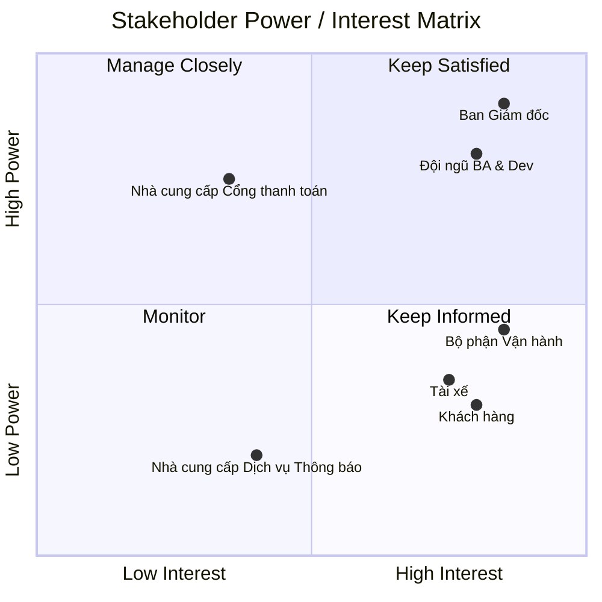

# 23642481_TranVanSang_Capsystem

<b>Phân Tích Vấn Đề của Hệ Thống Hiện Tại (Problem Statement & Q&A)</b> [Bấm để xem]

Dưới góc nhìn của Business Analyst (BA) kết hợp định hướng xây dựng giải pháp **MVP (Minimum Viable Product)** trong 7 tuần, dưới đây là bộ câu hỏi - câu trả lời làm rõ các vấn đề cốt lõi mà Công ty ABC đang gặp phải:

- **Q1: Quy trình điều phối chuyến xe hiện tại đang gặp bất cập gì lớn nhất?**
  - Thực trạng: Việc phân công tài xế chủ yếu được thực hiện thủ công qua tổng đài hoặc tiếp nhận từ ứng dụng đơn giản.
  - Hậu quả: Tốc độ ghép xe chậm, dễ nhầm lẫn hoặc sót chuyến khi lượng đặt tăng, lãng phí nguồn lực nhân sự tổng đài.
  - Định hướng MVP: Xây dựng cơ chế tự động tìm và gán chuyến cho tài xế gần nhất theo thuật toán định vị GPS, tự động chuyển chuyến tiếp theo nếu tài xế từ chối.

- **Q2: Khách hàng đang gặp khó khăn gì trong quá trình sử dụng dịch vụ?**
  - Thực trạng: Khách hàng không thể chủ động theo dõi trạng thái chuyến đi theo thời gian thực (không biết xe đang ở đâu, bao lâu tài xế đến nơi, ai là người nhận cuốc).
  - Hậu quả: Trải nghiệm khách hàng kém, phát sinh tâm lý sốt ruột dẫn đến tỷ lệ gọi điện hối thúc hoặc tự ý hủy chuyến cao.
  - Định hướng MVP: Cung cấp giao diện bản đồ trực quan theo dõi vị trí tài xế và trạng thái chuyến xe (Tìm tài xế -> Đã nhận -> Đã đến -> Đang chở khách -> Hoàn thành).

- **Q3: Vấn đề trong quản lý thanh toán và doanh thu hiện tại là gì?**
  - Thực trạng: Thông tin thanh toán chưa được quản lý tập trung; phụ thuộc nhiều vào tiền mặt hoặc đối soát rời rạc, chưa có liên kết chuẩn với các cổng thanh toán.
  - Hậu quả: Thất thoát doanh thu, đối soát công nợ với tài xế phức tạp, mất nhiều thời gian tổng hợp thủ công.
  - Định hướng MVP: Quản lý tập trung lịch sử giao dịch, hỗ trợ thanh toán tiền mặt và tích hợp 01 cổng thanh toán điện tử chuẩn bên ngoài đảm bảo tính bảo mật (không lưu trữ thông tin thẻ nhạy cảm).

- **Q4: Bộ phận vận hành (Operations) đang gặp rào cản gì trong việc giám sát và hỗ trợ?**
  - Thực trạng: Chưa có giao diện quản trị (Admin Portal) tập trung; khó theo dõi danh sách chuyến đang diễn ra, trạng thái tài xế và các trường hợp chuyến bị lỗi.
  - Hậu quả: Xử lý khiếu nại chậm trễ, không có dữ liệu để đánh giá hiệu suất (KPI) tài xế cũng như tỷ lệ hủy/hoàn thành chuyến.
  - Định hướng MVP: Xây dựng Dashboard quản trị cơ bản: quản lý tài khoản người dùng/tài xế, giám sát danh sách chuyến đi thực tế và tra cứu lịch sử sự cố.

- **Q5: Hệ thống hiện tại có đáp ứng được mục tiêu mở rộng và chịu tải cao không?**
  - Thực trạng: Kiến trúc cũ phụ thuộc lẫn nhau, hiệu năng kém khi nhu cầu tăng đột biến; một lỗi nhỏ ở khâu thông báo hoặc thanh toán có thể khiến toàn bộ hệ thống tê liệt.
  - Hậu quả: Doanh nghiệp không thể mở rộng quy mô kinh doanh, mở rộng loại hình dịch vụ hoặc tích hợp thêm đối tác bên thứ ba.
  - Định hướng MVP: Thiết kế kiến trúc dạng module hóa (decoupled), đảm bảo lỗi từ các dịch vụ phụ (thanh toán/thông báo) không làm gián đoạn luồng đặt xe cốt lõi.

---

### Bảng Tổng Hợp Vấn Đề & Giải Pháp MVP

| STT | Nhóm vấn đề | Thực trạng hiện tại | Giải pháp cốt lõi cho bản MVP (7 tuần) |
| :-- | :--- | :--- | :--- |
| **1** | **Điều phối xe** | Phân công tài xế thủ công | Tự động hóa thuật toán tìm và gán tài xế gần nhất |
| **2** | **Trải nghiệm khách hàng** | Mù thông tin về tiến trình chuyến đi | Cung cấp luồng Tracking thời gian thực & thông báo trạng thái |
| **3** | **Quản lý thanh toán** | Dữ liệu thanh toán phân tán, dễ thất thoát | Quản trị tập trung, tích hợp cổng thanh toán an toàn |
| **4** | **Vận hành & Giám sát** | Thiếu công cụ quản trị và báo cáo | Xây dựng Admin Dashboard quản lý User, Driver, Trip |
| **5** | **Khả năng mở rộng** | Hệ thống dễ sập khi quá tải hoặc có lỗi | Tách module độc lập, đảm bảo luồng lõi luôn hoạt động |

<b>Bước 1. Bảng Phân Tích Các Bên Liên Quan (Stakeholders)</b> [Bấm để xem]

| Tên bên liên quan | Vai trò trong hệ thống |
| :--- | :--- |
| **Ban giám đốc / Ban lãnh đạo** | - Đưa ra định hướng chiến lược và kỳ vọng phát triển nền tảng lâu dài. - Theo dõi các báo cáo về doanh thu, số lượng chuyến, tỷ lệ hoàn thành/hủy và hiệu quả vận hành của tài xế để ra quyết định kinh doanh. |
| **Khách hàng** | - Đăng ký, đăng nhập và cập nhật thông tin cá nhân. - Nhập điểm đón/đến, chọn loại xe, gửi yêu cầu đặt chuyến và theo dõi trạng thái chuyến đi. - Thực hiện thanh toán tiền cước và đánh giá tài xế sau khi hoàn thành chuyến. |
| **Tài xế** | - Đăng ký tài khoản, cập nhật hồ sơ cá nhân và thông tin phương tiện. - Bật/tắt trạng thái sẵn sàng làm việc để nhận thông báo chuyến. - Tiếp nhận hoặc từ chối yêu cầu đặt xe. - Cập nhật các trạng thái của chuyến đi (đã đến điểm đón, đã đón khách, đang di chuyển, hoàn thành) và chia sẻ vị trí phương tiện. |
| **Nhân viên vận hành** | - Sử dụng giao diện quản trị để quản lý danh sách khách hàng, tài xế, phương tiện và dữ liệu chuyến đi. - Tạo tài khoản cho tài xế (nếu cần). - Giám sát các chuyến đi đang diễn ra, kiểm tra trạng thái tài xế, hỗ trợ xử lý sự cố/chuyến đi bị lỗi và tra cứu lịch sử giao dịch. |
| **Chuyên viên Phân tích Nghiệp vụ** | - Xác định rõ phạm vi, tác nhân, quy trình nghiệp vụ, yêu cầu chức năng và phi chức năng. - Làm việc với các bên liên quan để làm rõ các quy tắc nghiệp vụ chưa hoàn thiện (cách tính cước, điều phối tài xế, chính sách hủy, xử lý mất mạng, lưu trữ dữ liệu) trước khi phát triển. |
| **Đội ngũ Phát triển & Triển khai** | - Thiết kế kiến trúc hệ thống linh hoạt, có khả năng mở rộng độc lập và chịu tải cao. - Xây dựng và triển khai toàn bộ nền tảng CAB trong khung thời gian 7 tuần. |
| **Nhà cung cấp dịch vụ thanh toán** | - Xử lý các giao dịch thanh toán điện tử bên ngoài hệ thống. - Đảm bảo bảo mật dữ liệu thẻ/tài khoản và phản hồi kết quả giao dịch thanh toán về hệ thống. |
| **Nhà cung cấp dịch vụ thông báo** | - Cung cấp hạ tầng gửi thông báo tự động (thông báo đẩy, tin nhắn) đến khách hàng và tài xế trong suốt hành trình. |

<b>Bước 2. Ma Trận Phân Loại Stakeholder (Power - Interest Matrix)</b> [Bấm để xem]

### 3.1 Sơ đồ Ma trận Quyền lực & Mức độ Quan tâm

### Stakeholder Power-Interest Matrix

<b>Bước 3: Vai trò, Mức độ quan trọng / Ảnh hưởng của Stakeholders và Mục đích Nghiệp vụ</b> [Bấm để xem]

#### 1. Bảng phân tích Vai trò, Mức độ ảnh hưởng và Kỳ vọng Hệ thống đáp ứng

| Stakeholder | Mức độ Quan trọng / Ảnh hưởng | Vai trò chính | Mục đích Nghiệp vụ (Business Goal) | Hệ thống CAB đáp ứng điều gì? |
| :--- | :--- | :--- | :--- | :--- |
| **Khách hàng (Customer)** | **Cao (High Impact)** | Người dùng dịch vụ cuối | Đặt xe nhanh chóng, di chuyển an toàn, minh bạch giá cả và trải nghiệm dịch vụ tiện lợi. | - Đăng ký/Đăng nhập, quản lý thông tin cá nhân. - Nhập điểm đi/đến, chọn loại xe và xem trước giá tiền. - Gửi yêu cầu đặt xe, theo dõi vị trí tài xế & trạng thái chuyến đi theo thời gian thực. - Thanh toán linh hoạt (Tiền mặt / Thẻ / Ví điện tử). - Xem lịch sử chuyến đi và đánh giá chất lượng tài xế. |
| **Tài xế (Driver)** | **Cao (High Impact)** | Đối tác cung cấp dịch vụ vận tải | Tối ưu thời gian chờ, tăng thu nhập, nhận chuyến xe minh bạch và hợp lý về vị trí. | - Quản lý hồ sơ cá nhân và thông tin phương tiện. - Chủ động bật/tắt trạng thái sẵn sàng nhận chuyến. - Nhận thông báo chuyến mới; chấp nhận hoặc từ chối chuyến đi. - Cập nhật lộ trình chuyến đi (*Đã đến điểm đón, Đã đón khách, Đang di chuyển, Hoàn thành*). - Định vị GPS liên tục để hệ thống ghép chuyến gần nhất. |
| **Nhân viên Vận hành (Operator / Admin)** | **Cao (High Importance)** | Quản lý & Giám sát hệ thống | Đảm bảo hệ thống vận hành liên tục, xử lý sự cố kịp thời và kiểm soát chất lượng dịch vụ. | - Cung cấp giao diện Admin Dashboard quản lý Khách hàng, Tài xế, Phương tiện. - Giám sát các chuyến đi realtime, can thiệp xử lý chuyến lỗi/kẹt trạng thái. - Tra cứu lịch sử giao dịch và phân quyền người dùng. - Báo cáo thống kê số chuyến, doanh thu, tỷ lệ hủy và hiệu suất tài xế. |
| **Ban Giám đốc (Board of Directors)** | **Rất cao (Critical)** | Chủ đầu tư & Quyết định chiến lược | Tự động hóa vận hành, mở rộng quy mô kinh doanh, tối ưu chi phí và tăng doanh thu. | - Hệ thống hoạt động ổn định, có khả năng mở rộng độc lập khi tải tăng. - Cung cấp số liệu báo cáo kinh doanh chính xác. - Kiến trúc linh hoạt, cho phép mở rộng tính năng/dịch vụ mới trong tương lai. |
| **Nhà cung cấp Cổng thanh toán (Payment Gateway)** | **Trung bình (Medium)** | Đối tác tích hợp hạ tầng thanh toán | Xử lý giao dịch thanh toán điện tử an toàn, chính xác và đối soát minh bạch. | - Tích hợp API thanh toán không lưu dữ liệu thẻ nhạy cảm trên CAB System. - Phản hồi trạng thái giao dịch (Thành công/Thất bại) tức thì. - Hỗ trợ cơ chế thử lại (retry) khi giao dịch thất bại. |
| **Nhà cung cấp Dịch vụ Thông báo (Notification Provider)** | **Thấp - Trung bình (Low - Medium)** | Đối tác gửi tin nhắn/thông báo | Truyền tải thông điệp và trạng thái chuyến đi tới người dùng nhanh chóng. | - Tích hợp API gửi Push Notification / SMS / Email theo thời gian thực. - Kiến trúc linh hoạt cho phép mở rộng thêm kênh thông báo mới mà không sửa toàn bộ hệ thống. |

---

#### 2. Mục đích Nghiệp vụ Tổng thể (Business Objectives Summary)

1. **Đối với Khách hàng:** Giải quyết triệt để bài toán "chờ đợi trong mơ hồ" bằng việc minh bạch hóa lộ trình, thời gian tài xế đến và giá cước.
2. **Đối với Tài xế:** Tối ưu hóa việc phân công chuyến đi bằng thuật toán ghép chuyến tự động dựa trên vị trí GPS, giảm thời gian chạy xe rỗng.
3. **Đối với Bộ phận Vận hành:** Chuyển đổi từ điều phối thủ công sang quản lý tự động hóa, giám sát tập trung toàn bộ dữ liệu chuyến đi và doanh thu.
4. **Đối với Doanh nghiệp (ABC):** Xây dựng nền tảng MVP vững chắc trong **7 tuần**, đáp ứng lượng tải lớn và sẵn sàng mở rộng các loại hình dịch vụ mới trong tương lai.
    

<b>Bước 4. Xác Định Phạm Vi Dự Án MVP Trong 7 Tuần (MVP Scope Baseline)</b> [Bấm để xem]

### 4.1 Nguyên tắc Xác định Phạm vi (Scoping Principles)
- **Mục tiêu 7 tuần:** Tập trung hoàn thiện luồng nghiệp vụ cốt lõi: Khách đặt xe -> Ghép tài xế -> Thực hiện chuyến -> Tính cước & Thanh toán -> Quản trị cơ bản.
- **Quy tắc MVP:** Đảm bảo hệ thống hoạt động ổn định, phân tách module độc lập, loại bỏ các tính năng phức tạp ngoài phạm vi (như AI dự đoán, gợi ý thông minh, định giá động đa biến).

---

### 4.2 Danh mục Các Phân hệ Cốt lõi (Core Modules in MVP)

#### Module 1: Quản lý Xác thực & Phân quyền (Authentication & Authorization)
- Đăng ký và đăng nhập tài khoản cho Khách hàng và Tài xế (bằng Số điện thoại/Mật khẩu hoặc OTP).
- Đăng nhập và phân quyền truy cập cho Nhân viên vận hành/Quản trị viên (RBAC).
- Quản lý phiên làm việc, mã hóa mật khẩu và bảo mật thông tin đăng nhập.

#### Module 2: Quản lý Hồ sơ Người dùng (User & Driver Profile Management)
- **Khách hàng:** Cập nhật thông tin cá nhân (Họ tên, SĐT, Email), xem lịch sử chuyến đi.
- **Tài xế:** Cập nhật hồ sơ, thông tin phương tiện (Biển số xe, loại xe, màu xe), trạng thái xét duyệt hoạt động.
- **Quản trị viên:** Tra cứu danh sách tài xế, phê duyệt/tạo tài khoản tài xế mới và khóa/mở khóa tài khoản khi có vi phạm.

#### Module 3: Quản lý Trạng thái & Vị trí Tài xế (Driver Status & Geolocation Tracking)
- Bật/tắt trạng thái làm việc của tài xế (Sẵn sàng nhận chuyến / Đang bận / Ngoại tuyến).
- Thu thập và cập nhật tọa độ GPS định kỳ của tài xế khi đang ở trạng thái trực tuyến.
- Lưu trữ vị trí cuối cùng của tài xế phục vụ thuật toán tìm xe theo bán kính.

#### Module 4: Đặt xe & Điều phối Chuyến đi (Booking & Dispatching Engine)
- Tiếp nhận yêu cầu đặt chuyến từ khách hàng (Điểm đón, Điểm đến, Loại xe).
- Thuật toán ghép xe cơ bản dựa trên khoảng cách địa lý (tìm tài xế gần nhất đang sẵn sàng trong bán kính quy định).
- Cơ chế gửi yêu cầu nhận cuốc tới tài xế với thời gian chờ (timeout).
- Tự động chuyển yêu cầu sang tài xế tiếp theo nếu tài xế trước từ chối hoặc hết giờ phản hồi.
- Thông báo cho khách hàng khi tìm thấy tài xế hoặc khi không có xe nào nhận chuyến.

#### Module 5: Quản lý Tiến trình Chuyến đi (Trip Lifecycle Management)
- Máy trạng thái chuyến đi: Khởi tạo -> Đang tìm xe -> Đã nhận chuyến -> Đã đến điểm đón -> Đang di chuyển -> Hoàn thành / Hủy chuyến.
- Cho phép tài xế thao tác cập nhật từng bước trạng thái chuyến đi.
- Cho phép khách hàng và nhân viên vận hành theo dõi trạng thái và vị trí xe theo thời gian thực.
- Xử lý luồng hủy chuyến từ phía khách hàng hoặc tài xế theo quy tắc cơ bản.

#### Module 6: Tính cước & Thanh toán (Pricing & Payment Integration)
- Công thức tính cước cơ bản: Giá mở cửa + (Khoảng cách thực tế × Đơn giá/km) theo từng loại xe.
- Hỗ trợ 02 phương thức thanh toán: Tiền mặt trực tiếp và Tích hợp 01 Cổng thanh toán điện tử (Payment Gateway).
- Xử lý kết quả giao dịch thanh toán (Thành công / Thất bại) và ghi nhận lịch sử giao dịch không lưu trữ dữ liệu thẻ nhạy cảm.

#### Module 7: Quản lý Thông báo (Notification Service)
- Gửi thông báo đẩy (Push Notification/In-app) cho khách hàng và tài xế tại các mốc sự kiện chính của chuyến đi.
- Tách biệt module thông báo độc lập để đảm bảo nghẽn thông báo không gây dừng luồng đặt xe.

#### Module 8: Cổng Quản trị Vận hành & Báo cáo Cơ bản (Admin Portal & Basic Reports)
- Dashboard theo dõi danh sách các chuyến đi đang diễn ra và lịch sử sự cố.
- Chức năng hỗ trợ can thiệp/hủy cuốc khi phát sinh lỗi hệ thống hoặc khiếu nại.
- Báo cáo thống kê cơ bản: Tổng số chuyến đi, doanh thu theo ngày/tuần, tỷ lệ hoàn thành và tỷ lệ hủy chuyến.

---

### 4.3 Bảng Tổng hợp Phạm vi (In-Scope vs Out-of-Scope)

| STT | Phân hệ / Nghiệp vụ | Trong phạm vi MVP (7 tuần) | 
| :-- | :--- | :--- | 
| 1 | **Xác thực** | Đăng ký, đăng nhập chuẩn (Phone/Password/OTP) | 
| 2 | **Điều phối xe** | Tìm theo bán kính gần nhất, chuyển lượt tuần tự | 
| 3 | **Định giá (Pricing)** | Giá cố định theo km và loại xe cơ bản | 
| 4 | **Thanh toán** | Tiền mặt + Tích hợp 01 cổng thanh toán online | 
| 5 | **Thông báo** | Push Notification / In-app cơ bản | 
| 6 | **Báo cáo** | Thống kê số lượng chuyến, doanh thu, tỷ lệ hủy | 

<b>Bước 5. Phân Tích Yêu Cầu Nghiệp Vụ & Phạm Vi Bảng MVP (Business Requirements & MVP Scope Table)</b> [Bấm để xem]

### Bảng Phân tích Yêu cầu Nghiệp vụ (Business Requirements & MVP Scope Table)

Dựa trên yêu cầu của Công ty ABC, các mong muốn vận hành được chuyển đổi thành các Yêu cầu Nghiệp vụ (BR) cốt lõi và phân định phạm vi triển khai trong giai đoạn MVP (7 tuần) và phiên bản Tương lai (Phase 2).

| Nhóm Nghiệp vụ | Mã BR | Yêu cầu Nghiệp vụ (Business Requirement) | Mô tả Chi tiết Nghiệp vụ | Phạm vi MVP (7 tuần) | Giai đoạn Tương lai (Phase 2) |
| :--- | :--- | :--- | :--- | :---: | :---: |
| **Quản lý Tài khoản & Hồ sơ** | BR-01 | Quản lý Tài khoản Khách hàng | Cho phép Khách hàng đăng ký, đăng nhập, xác thực tài khoản và cập nhật thông tin cá nhân. | **[X] Co-Core** | |
| | BR-02 | Quản lý Tài khoản & Hồ sơ Tài xế | Cho phép Tài xế/Nhân viên vận hành tạo tài khoản, cập nhật thông tin cá nhân, hồ sơ pháp lý, thông tin phương tiện và loại xe. | **[X] Co-Core** | |
| | BR-03 | Phân quyền Quản trị (RBAC) | Phân quyền chặt chẽ các thao tác quản trị; Nhân viên vận hành thông thường không được thực hiện các tác vụ nhạy cảm. | **[X] Co-Core** | |
| **Đặt xe & Tìm tài xế** | BR-04 | Đặt xe & Chọn Dịch vụ | Cho phép Khách hàng nhập điểm đón, điểm đến, hệ thống tính trước khoảng cách/giá tiền và cho phép khách chọn loại dịch vụ xe. | **[X] Co-Core** | |
| | BR-05 | Khớp chuyến Tự động (Matching Engine) | Tự động định vị GPS, tìm kiếm và ưu tiên gán chuyến cho tài xế phù hợp gần nhất đang ở trạng thái sẵn sàng. | **[X] Co-Core** | |
| | BR-06 | Xử lý Từ chối / Timeout nhận chuyến | Tự động chuyển tiếp chuyến đi cho tài xế khác nếu tài xế đầu tiên từ chối hoặc hết thời gian phản hồi (timeout) mà không bắt khách tạo lại yêu cầu. | **[X] Co-Core** | |
| | BR-07 | Xử lý Không tìm thấy Tài xế | Đưa ra thông báo rõ ràng cho Khách hàng khi đã hết tài xế khả dụng hoặc tìm kiếm thất bại sau thời gian quy định. | **[X] Co-Core** | |
| | BR-08 | Thuật toán Tăng giá & Ưu tiên nâng cao | Áp dụng Dynamic Pricing (tăng giá giờ cao điểm) và thuật toán phân công nâng cao theo hiệu suất/đánh giá tài xế. | | **[X] Post-MVP** |
| **Thực hiện & Theo dõi Chuyến** | BR-09 | Quản lý Trạng thái Sẵn sàng Tài xế | Cho phép Tài xế chủ động bật/tắt trạng thái sẵn sàng làm việc để nhận thông báo chuyến xe mới. | **[X] Co-Core** | |
| | BR-10 | Quản lý Tiến độ Chuyến đi (Trip Lifecycle) | Hỗ trợ Tài xế cập nhật lần lượt các trạng thái: *Đã nhận chuyến &rarr; Đã đến điểm đón &rarr; Đã đón khách &rarr; Đang di chuyển &rarr; Hoàn thành*. | **[X] Co-Core** | |
| | BR-11 | Theo dõi Hành trình Realtime (Tracking) | Ghi nhận vị trí GPS thời gian thực của Tài xế để Khách hàng theo dõi vị trí xe, lộ trình di chuyển và thời gian dự kiến đến (ETA). | **[X] Co-Core** | |
| | BR-12 | Xử lý Mất kết nối Mạng (Offline Handling) | Cơ chế lưu cache trên ứng dụng di động để tự động đồng bộ lại trạng thái khi thiết bị khôi phục kết nối mạng. | | **[X] Post-MVP** |
| **Tính cước & Thanh toán** | BR-13 | Tính cước Chuyến đi | Tự động tính tổng tiền cước sau khi kết thúc chuyến dựa trên loại xe, khoảng cách thực tế và bảng cước cố định. | **[X] Co-Core** | |
| | BR-14 | Thanh toán Tiền mặt | Cho phép Khách hàng chọn thanh toán trực tiếp bằng tiền mặt cho Tài xế sau khi chuyến đi hoàn thành. | **[X] Co-Core** | |
| | BR-15 | Thanh toán Điện tử qua Cổng bên thứ ba | Tích hợp API với 01 Cổng thanh toán bên thứ ba (Ví/Thẻ) để xử lý thanh toán điện tử; không lưu thông tin thẻ nhạy cảm trên hệ thống CAB. | **[X] Co-Core** | |
| | BR-16 | Xử lý Lỗi Thanh toán Điện tử | Thông báo lỗi thanh toán rõ ràng cho Khách hàng và hỗ trợ cơ chế thanh toán lại (retry) hoặc chuyển sang tiền mặt. | **[X] Co-Core** | |
| | BR-17 | Thêm nhiều Phương thức Thanh toán mới | Tích hợp đa dạng các Ví điện tử (Momo, ZaloPay, ShopeePay) và thẻ quốc tế Visa/Mastercard trực tiếp. | | **[X] Post-MVP** |
| **Thông báo & Đánh giá** | BR-18 | Gửi Thông báo Trạng thái (Notifications) | Tự động gửi thông báo đẩy (Push Notification) cho Khách hàng và Tài xế tương ứng với các mốc thay đổi trạng thái chuyến đi & thanh toán. | **[X] Co-Core** | |
| | BR-19 | Đánh giá & Phản hồi Sau Chuyến đi | Cho phép Khách hàng chấm điểm sao (1-5 star) và để lại phản hồi về chất lượng phục vụ của Tài xế sau khi hoàn thành chuyến đi. | **[X] Co-Core** | |
| | BR-20 | Mở rộng Kênh Thông báo (SMS/Email) | Bổ sung thêm các kênh gửi thông báo tự động qua tin nhắn SMS OTP và Email xác nhận hóa đơn. | | **[X] Post-MVP** |
| **Vận hành & Báo cáo** | BR-21 | Dashboard Quản trị & Giám sát Realtime | Cung cấp giao diện Admin Dashboard cho Nhân viên vận hành quản lý Khách hàng, Tài xế, Phương tiện, tra cứu lịch sử và giám sát các chuyến đi đang diễn ra. | **[X] Co-Core** | |
| | BR-22 | Báo cáo Thống kê Cơ bản | Xuất các báo cáo theo thời gian về: Tổng số chuyến đi, Doanh thu, Tỷ lệ chuyến hoàn thành và Tỷ lệ hủy chuyến. | **[X] Co-Core** | |
| | BR-23 | Báo cáo Hiệu quả Vận hành Nâng cao | Thống kê chi tiết hiệu suất làm việc từng tài xế, biểu đồ nhiệt (Heatmap) khu vực nhu cầu cao và dự báo xu hướng vận hành. | | **[X] Post-MVP** |
| **Kiến trúc & Bảo mật** | BR-24 | Thiết kế Mô-đun Độc lập (Microservices/Modular) | Tách biệt các thành phần (Thanh toán, Thông báo, Khớp chuyến) để có thể mở rộng độc lập và tránh lỗi dây chuyền làm sập toàn bộ ứng dụng. | **[X] Co-Core** | |
| | BR-25 | Nhật ký Thao tác (Audit Trail) | Lưu vết (Log) toàn bộ các thao tác quản trị quan trọng và giao dịch thanh toán để phục vụ công tác tra soát khi xảy ra sự cố. | **[X] Co-Core** | |

<b>Bước 6. Phân Rã Yêu Cầu Chức Năng (Functional Requirements Breakdown)</b> [Bấm để xem]

### Phân Rã Chi Tiết Yêu Cầu Chức Năng (Functional Requirements Breakdown)

Dựa trên các Yêu cầu Nghiệp vụ (BR), dưới đây là chi tiết các chức năng hệ thống cần xử lý cho từng luồng nghiệp vụ cốt lõi:

#### 1. Module Đặt Xe & Tìm Tài Xế (Ride Dispatch & Matching Engine)

* **FR-MATCH-01 (Xác định vị trí Khách hàng):** Hệ thống truy xuất tọa độ GPS điểm đón và điểm đến do khách hàng cung cấp (hoặc tự động lấy từ vị trí thiết bị).
* **FR-MATCH-02 (Lọc danh sách Tài xế khả dụng):**
    * Hệ thống quét danh sách tài xế trong bán kính quy định (ví dụ: 3km - 5km).
    * Điều kiện lọc: Tài xế đang ở trạng thái **Sẵn sàng (Online)**, loại phương tiện trùng khớp với yêu cầu của khách hàng.
* **FR-MATCH-03 (Thuật toán Điểm ưu tiên & Đề xuất):**
    * Xếp hạng tài xế khả dụng dựa trên: Khoảng cách ngắn nhất đến điểm đón, thời gian di chuyển dự kiến (ETA), điểm đánh giá (Rating) cao và tỷ lệ nhận chuyến tốt.
* **FR-MATCH-04 (Gửi yêu cầu & Chờ phản hồi):**
    * Gửi thông báo mời nhận chuyến đến Tài xế có điểm ưu tiên cao nhất kèm đếm ngược thời gian (Timeout, ví dụ: 15 giây).
    * **Trường hợp Tài xế Chấp nhận:** Chuyển trạng thái chuyến đi sang *Đã nhận chuyến*, khóa trạng thái tài xế (Bận), gửi thông báo thông tin tài xế cho khách hàng.
    * **Trường hợp Tài xế Từ chối hoặc Hết giờ (Timeout):** Hệ thống tự động loại tài xế này khỏi lượt tìm kiếm hiện tại, cập nhật danh sách và tự động chuyển gửi yêu cầu đến Tài xế ưu tiên tiếp theo mà không bắt Khách hàng tạo lại yêu cầu đặt xe.
* **FR-MATCH-05 (Xử lý không tìm được tài xế):** Nếu quá thời gian tìm kiếm hoặc đã quét hết danh sách tài xế khả dụng mà không có ai nhận, hệ thống gửi thông báo *"Hiện tại không tìm thấy tài xế, vui lòng thử lại sau"* đến Khách hàng và hủy yêu cầu đặt xe.

#### 2. Module Quản Lý Tiến Độ Chuyến Đi (Trip Lifecycle & Live Tracking)

* **FR-TRIP-01 (Cập nhật tiến độ hành trình):** Cung cấp các nút thao tác trên ứng dụng Tài xế để cập nhật trạng thái theo thứ tự:
    1. *Đã đến điểm đón*: Gửi thông báo báo khách hàng ra xe.
    2. *Đã đón khách*: Bắt đầu tính giờ/khoảng cách hành trình thực tế.
    3. *Đang di chuyển*: Cập nhật lộ trình realtime.
    4. *Hoàn thành chuyến*: Chốt chuyến đi và chuyển sang bước tính cước/thanh toán.
* **FR-TRIP-02 (Theo dõi vị trí Realtime):** Hệ thống thu thập tọa độ GPS của Tài xế định kỳ (mỗi 3-5 giây) và hiển thị trực quan biểu tượng xe di chuyển trên bản đồ phía Khách hàng kèm thời gian dự kiến đến (ETA).

#### 3. Module Tính Cước & Thanh Toán (Pricing & Payment)

* **FR-PAY-01 (Tính cước tự động):** Khi kết thúc chuyến, hệ thống tính cước dựa trên: Bảng cước loại xe + Khoảng cách thực tế di chuyển + Phụ phí (nếu có).
* **FR-PAY-02 (Xử lý Thanh toán Tiền mặt):** Hiển thị số tiền cần thu trên app Tài xế và Khách hàng; Tài xế xác nhận *"Đã thu tiền mặt"* để đóng chuyến đi.
* **FR-PAY-03 (Xử lý Thanh toán Điện tử qua Cổng thứ 3):**
    * Gọi API sang Cổng thanh toán để trừ tiền/khóa tiền khoản thanh toán của Khách hàng.
    * **Thành công:** Xác nhận hoàn tất thanh toán, cập nhật trạng thái hóa đơn.
    * **Thất bại:** Gửi thông báo lỗi cho Khách hàng, cung cấp tùy chọn *Thử lại giao dịch (Retry)* hoặc *Chuyển sang thanh toán tiền mặt*.
* **FR-PAY-04 (An toàn dữ liệu):** Không lưu trữ bất kỳ thông tin nhạy cảm nào về thẻ/tài khoản ngân hàng của người dùng trên hệ thống CAB.

#### 4. Module Đánh Giá & Thông Báo (Feedback & Notifications)

* **FR-NOTI-01 (Hệ thống Thông báo Đẩy - Push Notification):** Tự động bắn thông báo cho Khách hàng/Tài xế ứng với các sự kiện: *Tìm thấy tài xế, Xe đã đến điểm đón, Chuyến đi hoàn thành, Thanh toán thành công/thất bại*.
* **FR-RATING-01 (Đánh giá sau chuyến đi):** Cho phép Khách hàng chấm điểm (1 đến 5 sao) và chọn các nhãn góp ý/viết nhận xét về Tài xế sau khi hoàn thành chuyến.

#### 5. Module Quản Trị & Giám Sát Vận Hành (Admin & Operations Management)

* **FR-ADM-01 (Quản lý Hồ sơ & Phân quyền):** Cho phép Nhân viên vận hành phê duyệt/khóa tài khoản Khách hàng, Tài xế, Phương tiện; Phân quyền thao tác theo nhóm quyền (RBAC).
* **FR-ADM-02 (Giám sát Chuyến đi Realtime):** Hiển thị bản đồ tổng quan các chuyến đi đang thực hiện, hỗ trợ Nhân viên vận hành can thiệp hủy chuyến hoặc gán lại tài xế khi xảy ra sự cố khẩn cấp.
* **FR-ADM-03 (Báo cáo Thống kê):** Xuất các biểu đồ & bảng biểu báo cáo về: Doanh thu theo ngày/tần suất, Tổng số chuyến, Tỷ lệ hủy chuyến, và Báo cáo hiệu suất từng tài xế.

<b>Bước 7. Sơ Đồ Use Case Tổng Quan (Use Case Diagram)</b> [Bấm để xem]

### Sơ Đồ Use Case Hệ Thống CAB System

<b>Bước 8. Đặc Tả Chi Tiết Các Use Case Quan Trọng (Use Case Specifications)</b> [Bấm để xem]

### 1. Đặc tả Use Case "Đặt xe"

**Tiền điều kiện:** Khách hàng đã đăng nhập thành công vào ứng dụng. Thiết bị di động đã bật vị trí (GPS).  
**Hậu điều kiện:** Tạo chuyến đi thành công trên hệ thống. Trạng thái chuyến đi chuyển sang "Chờ tài xế nhận".  
**Actor chính:** Khách hàng  
**Actor phụ:** Không  

#### Basic flow

| Khách hàng | Hệ thống |
| :--- | :--- |
| 1. Chọn chức năng "Đặt xe". | 2. Tự động lấy vị trí hiện tại làm điểm đón và hiển thị bản đồ. |
| 3. Nhập/chọn điểm đến và chọn loại dịch vụ xe (Xe 4 chỗ, Xe 7 chỗ, Xe máy). | 4. Tính toán quãng đường, ước tính thời gian di chuyển và hiển thị giá tiền cho từng loại dịch vụ. |
| 5. Chọn phương thức thanh toán (Tiền mặt hoặc Cổng điện tử) và xác nhận "Đặt xe". | 6. Kiểm tra tính hợp lệ của yêu cầu đặt xe. |
| | 7. Lưu thông tin chuyến đi vào CSDL với trạng thái "Chờ tài xế nhận". |
| | 8. Kích hoạt luồng phát thông báo tìm tài xế ở gần điểm đón. |
| | 9. Hiển thị màn hình chờ tài xế nhận chuyến. |

#### Alternative flow
* **3.1 Khách hàng muốn thay đổi điểm đón:**
  1. Khách hàng ghim vị trí mới hoặc nhập địa chỉ điểm đón thủ công.
  2. Hệ thống cập nhật lại vị trí điểm đón trên bản đồ.
  3. Quay lại bước 4.
* **5.1 Khách hàng nhập mã giảm giá (Voucher):**
  1. Khách hàng chọn/nhập mã giảm giá.
  2. Hệ thống kiểm tra điều kiện áp dụng mã và tự động tính lại tổng tiền.
  3. Quay lại bước 5.

#### Exception flow
* **6.1 Hệ thống không định vị được vị trí GPS của khách hàng:**
  1. Hệ thống hiển thị thông báo lỗi "Không thể lấy vị trí hiện tại, vui lòng kiểm tra bật GPS hoặc nhập địa chỉ thủ công".
  2. Quay lại bước 3.
* **8.1 Hết thời gian chờ mà không có tài xế nào nhận chuyến:**
  1. Hệ thống hiển thị thông báo "Rất tiếc, hiện tại không có tài xế trống ở khu vực của bạn".
  2. Hệ thống hủy yêu cầu đặt xe và quay lại màn hình trang chủ.

---

### 2. Đặc tả Use Case "Cập nhật tiến độ chuyến đi"

**Tiền điều kiện:** Tài xế đã đăng nhập thành công vào hệ thống. Tài xế đã nhận chuyến đi của Khách hàng và đang trong luồng di chuyển.  
**Hậu điều kiện:** Trạng thái chuyến đi được lưu và cập nhật liên tục trên CSDL. Thông báo và vị trí realtime được đồng bộ đến màn hình của Khách hàng.  
**Actor chính:** Tài xế  
**Actor phụ:** Khách hàng  

#### Basic flow

| Tài xế | Hệ thống |
| :--- | :--- |
| 1. Chọn chức năng "Bắt đầu đón khách" và di chuyển tới điểm đón. | 2. Cập nhật trạng thái chuyến đi sang "Tài xế đang đến" và bật định vị vị trí realtime của tài xế. |
| 3. Chọn nút "Đã đến điểm đón" khi tới nơi. | 4. Cập nhật trạng thái chuyến đi sang "Tài xế đã tới điểm đón" và gửi thông báo nhắc Khách hàng ra xe. |
| 5. Khách hàng lên xe, Tài xế chọn nút "Bắt đầu chuyến đi". | 6. Cập nhật trạng thái chuyến đi sang "Đang di chuyển" và hiển thị tuyến đường điều hướng đến điểm đến. |
| 7. Di chuyển tới điểm trả khách và chọn nút "Hoàn thành chuyến đi". | 8. Cập nhật trạng thái chuyến đi sang "Chờ thanh toán". |
| | 9. Tự động kích hoạt Use Case "Thanh toán". |
| | 10. Hiển thị thông báo hoàn thành chuyến đi và màn hình tổng kết tiền cước. |

#### Alternative flow
* **3.1 Tài xế không tìm thấy khách hàng tại điểm đón:**
  1. Tài xế chọn chức năng "Gọi điện / Nhắn tin cho Khách hàng".
  2. Hệ thống kết nối cuộc gọi hoặc hiển thị màn hình chat bảo mật.
  3. Tài xế trao đổi xác nhận lại vị trí đứng của khách hàng.
  4. Quay lại bước 5.

#### Exception flow
* **5.1 Khách hàng không xuất hiện sau thời gian chờ quy định (Quá 10 phút):**
  1. Tài xế chọn nút "Hủy chuyến do khách không đến".
  2. Hệ thống kiểm tra thời gian chờ và vị trí GPS của tài xế tại điểm đón.
  3. Hệ thống tính phí hủy chuyến (nếu có) áp dụng cho tài khoản Khách hàng.
  4. Hệ thống cập nhật trạng thái chuyến đi sang "Đã hủy do khách không đến" và kết thúc use case.
* **7.1 Xe gặp sự cố hoặc sự cố giao thông trên đường:**
  1. Tài xế chọn nút "Báo cáo sự cố chuyến đi".
  2. Hệ thống ghi nhận vị trí, thông báo cho Nhân viên vận hành hỗ trợ và cho phép Khách hàng/Tài xế hủy chuyến khẩn cấp.

---

### 3. Đặc tả Use Case "Thanh toán"

**Tiền điều kiện:** Chuyến đi đã chuyển sang trạng thái "Chờ thanh toán" (Tài xế đã bấm hoàn thành chuyến đi).  
**Hậu điều kiện:** Tiền cước được ghi nhận hoàn tất. Trạng thái chuyến đi cập nhật sang "Đã hoàn tất". Hóa đơn điện tử được lưu vào CSDL và gửi cho Khách hàng.  
**Actor chính:** Khách hàng, Tài xế  
**Actor phụ:** Cổng thanh toán (VNPAY/Momo/ZaloPay/Thẻ)  

#### Basic flow

| Actor | Hệ thống |
| :--- | :--- |
| 1. (Tài xế/Khách hàng) Xem số tiền thanh toán hiển thị trên ứng dụng. | 2. Hiển thị tổng tiền cước chi tiết (bao gồm phụ phí, mã giảm giá) và phương thức thanh toán đã chọn từ ban đầu. |
| 3. Khách hàng thực hiện thanh toán bằng tiền mặt cho tài xế. | 4. Tài xế nhận tiền mặt và chọn "Xác nhận đã thu tiền". |
| | 5. Kiểm tra và xác nhận giao dịch thành công. |
| | 6. Cập nhật trạng thái chuyến đi sang "Đã hoàn tất". |
| | 7. Cộng tiền vào tài khoản ví tài xế (sau khi trừ chiết khấu sàn). |
| | 8. Hiển thị thông báo thanh toán thành công và hiển thị màn hình đánh giá chuyến đi cho Khách hàng. |

#### Alternative flow
* **3.1 Phương thức thanh toán là Cổng điện tử (Thẻ/Ví điện tử):**
  1. Hệ thống tự động gửi yêu cầu trừ tiền đến Cổng thanh toán liên kết.
  2. Cổng thanh toán xử lý và phản hồi kết quả "Giao dịch thành công".
  3. Hệ thống tự động bỏ qua bước 3, 4 và nhảy thẳng đến bước 6.
* **3.2 Khách hàng muốn chuyển từ Tiền mặt sang Thanh toán bằng Cổng điện tử / Mã QR:**
  1. Khách hàng chọn "Đổi phương thức thanh toán".
  2. Hệ thống hiển thị mã QR thanh toán động cho chuyến đi.
  3. Khách hàng dùng ứng dụng ngân hàng/ví điện tử quét mã QR để chuyển khoản.
  4. Sau khi nhận tín hiệu gạch nợ thành công, quay lại bước 6.

#### Exception flow
* **3.1.1 Cổng thanh toán điện tử báo lỗi hoặc tài khoản không đủ số dư:**
  1. Hệ thống hiển thị thông báo "Thanh toán qua ví/thẻ thất bại. Vui lòng thử lại hoặc đổi sang thanh toán tiền mặt".
  2. Khách hàng chọn thanh toán tiền mặt cho tài xế.
  3. Quay lại bước 3 của Basic flow.

---

### 4. Đặc tả Use Case "Đăng ký / Đăng nhập"

**Tiền điều kiện:** Người dùng (Khách hàng / Tài xế / NV Vận hành) đã mở ứng dụng hoặc truy cập vào hệ thống.  
**Hậu điều kiện:** Hệ thống xác thực danh tính thành công, tạo phiên làm việc (Session/JWT Token) và chuyển người dùng đến giao diện tương ứng với vai trò.  
**Actor chính:** Khách hàng, Tài xế, Nhân viên vận hành  
**Actor phụ:** Hệ thống gửi SMS OTP / Email Firebase  

#### Basic flow

| Actor | Hệ thống |
| :--- | :--- |
| 1. Chọn chức năng "Đăng nhập" và nhập Số điện thoại / Email cùng Mật khẩu. | 2. Kiểm tra thông tin tài khoản trong cơ sở dữ liệu. |
| | 3. Mật khẩu hợp lệ, hệ thống tạo mã token xác thực phiên đăng nhập. |
| | 4. Cập nhật thời gian đăng nhập gần nhất của người dùng. |
| | 5. Khởi tạo giao diện làm việc chính theo đúng quyền hạn/vai trò (Role) của tài khoản. |

#### Alternative flow
* **1.1 Đăng nhập bằng mã OTP qua Số điện thoại:**
  1. Người dùng nhập Số điện thoại và chọn "Gửi mã OTP".
  2. Hệ thống tạo và gửi mã OTP 6 chữ số qua SMS.
  3. Người dùng nhập mã OTP nhận được.
  4. Hệ thống đối soát mã OTP; nếu đúng, tự động đăng nhập và nhảy đến bước 4.
* **1.2 Đăng ký tài khoản mới (Chưa có tài khoản):**
  1. Tại màn hình đăng nhập, người dùng chọn "Đăng ký ngay".
  2. Người dùng điền Họ tên, Số điện thoại, Email và Mật khẩu mới.
  3. Hệ thống kiểm tra dữ liệu, gửi OTP kích hoạt tài khoản.
  4. Người dùng nhập OTP thành công, hệ thống lưu tài khoản mới vào CSDL và tự động thực hiện Đăng nhập (Chuyển sang Bước 4).

#### Exception flow
* **2.1 Số điện thoại / Email hoặc Mật khẩu không chính xác:**
  1. Hệ thống hiển thị thông báo "Thông tin đăng nhập không đúng, vui lòng kiểm tra lại".
  2. Quay lại bước 1 để người dùng nhập lại.
* **1.1.1 Mã OTP hết hạn hoặc nhập sai quá 3 lần:**
  1. Hệ thống cảnh báo "Mã OTP không hợp lệ hoặc đã hết hạn".
  2. Khóa chức năng gửi OTP trong 60 giây và yêu cầu người dùng bấm "Gửi lại OTP".

---

### 5. Đặc tả Use Case "Giám sát chuyến đi realtime"

**Tiền điều kiện:** Nhân viên vận hành đã đăng nhập thành công vào hệ thống quản trị (Admin Portal). Có các chuyến đi đang diễn ra trên hệ thống.  
**Hậu điều kiện:** Nhân viên nắm bắt được tọa độ, tuyến đường, thông tin tài xế - khách hàng và trạng thái hiện tại của chuyến đi để kịp thời xử lý khi có bất thường.  
**Actor chính:** Nhân viên vận hành  
**Actor phụ:** Không  

#### Basic flow

| Nhân viên vận hành | Hệ thống |
| :--- | :--- |
| 1. Truy cập vào phân hệ "Giám sát chuyến đi Realtime". | 2. Hiển thị bản đồ tổng quan khu vực kèm các icon chuyến đi đang hoạt động (Đang đón, Đang di chuyển). |
| 3. Nhập mã chuyến đi / biển số xe / SĐT khách hàng vào thanh tìm kiếm hoặc chọn 1 chuyến đi trên bản đồ. | 4. Hiển thị chi tiết chuyến đi: Tọa độ GPS hiện tại của xe, vị trí đón/trả, thông tin Khách hàng, Tài xế và tốc độ di chuyển. |
| | 5. Tự động đồng bộ vị trí xe trên bản đồ theo chu kỳ 3-5 giây/lần (thông qua WebSocket). |

#### Alternative flow
* **3.1 Lọc danh sách chuyến đi theo trạng thái hoặc khu vực:**
  1. Nhân viên chọn bộ lọc (Ví dụ: "Chuyến đi bị hoãn quá 15 phút", "Khu vực Quận 1").
  2. Hệ thống cập nhật bản đồ và danh sách chuyến đi thỏa mãn điều kiện lọc.
  3. Quay lại bước 4.

#### Exception flow
* **5.1 Mất tín hiệu GPS hoặc mất kết nối với thiết bị tài xế:**
  1. Hệ thống phát hiện thiết bị tài xế không gửi tọa độ quá 3 phút.
  2. Hệ thống đánh dấu chuyến đi cảnh báo màu đỏ ("Mất kết nối GPS") và gửi thông báo tín hiệu nguy hiểm cho Nhân viên vận hành.
  3. Nhân viên vận hành chọn chức năng "Liên hệ khẩn cấp" để gọi cho tài xế hoặc khách hàng kiểm tra độ an toàn.

<b>Bước 9. Phân Tích Quy Trình Nghiệp Vụ (Business Process Analysis)</b> [Bấm để xem]

### Phân tích Chi tiết Quy trình Nghiệp vụ: Từ Đặt xe đến Hoàn thành chuyến đi

Quy trình nghiệp vụ cốt lõi của hệ thống CAB System mô tả toàn bộ dòng chảy thông tin và sự tương tác giữa Khách hàng, Tài xế và Hệ thống qua 4 giai đoạn chính:

#### Giai đoạn 1: Khởi tạo Yêu cầu Đặt xe (Customer Request Phase)
1. **Khách hàng** chọn vị trí đón (mặc định lấy theo GPS hoặc nhập thủ công) và nhập địa chỉ điểm đến.
2. **Hệ thống** tiếp nhận tọa độ, tính toán khoảng cách di chuyển, dự báo thời gian và tự động quy đổi cước phí cho các loại hình dịch vụ (Xe 4 chỗ, Xe 7 chỗ, Xe máy).
3. **Khách hàng** chọn phương thức thanh toán (Tiền mặt hoặc Ví/Thẻ điện tử), áp dụng mã giảm giá (nếu có) và nhấn nút **"Đặt xe"**.
4. **Hệ thống** kiểm tra tính hợp lệ của yêu cầu và tạo một bản ghi chuyến đi mới trong cơ sở dữ liệu với trạng thái **"Chờ tài xế nhận"**.

#### Giai đoạn 2: Khớp chuyến & Điều phối Tài xế (Driver Matching & Dispatching)
1. **Hệ thống** quét danh sách các tài xế đang ở trạng thái "Sẵn sàng" (Online) trong bán kính quanh điểm đón (ví dụ: 3 km).
2. **Hệ thống** chọn tài xế phù hợp nhất và phát thông báo mời nhận chuyến kèm thông tin điểm đón, điểm đến và cước phí ước tính.
3. **Xử lý phản hồi từ Tài xế:**
   * **Trường hợp Tài xế Từ chối (Reject) hoặc Quá thời gian phản hồi (15 giây):**
     * Hệ thống ghi nhận tài xế này đã bỏ qua chuyến đi.
     * Hệ thống ngay lập tức chuyển thông báo mời nhận chuyến sang tài xế tiếp theo trong danh sách ưu tiên.
   * **Trường hợp Tất cả Tài xế trong khu vực đều Từ chối / Không có tài xế rảnh:**
     * Hệ thống thử lại tối đa 3 lần tìm kiếm. Nếu vẫn không có tài xế, hệ thống phát thông báo *"Rất tiếc, hiện chưa tìm thấy tài xế rảnh quanh khu vực của bạn"*, tự động hủy yêu cầu và kết thúc quy trình.
   * **Trường hợp Tài xế Đồng ý (Accept):**
     * Hệ thống lập tức khóa trạng thái của tài xế sang "Bận" (tránh bị gán chuyến trùng).
     * Cập nhật trạng thái chuyến đi sang **"Tài xế đang đến đón"**.
     * Gửi thông báo ghép chuyến thành công cho Khách hàng kèm thông tin tài xế, biển số xe, số điện thoại và vị trí xe di chuyển realtime trên bản đồ.

#### Giai đoạn 3: Thực hiện Chuyến đi & Xử lý Ngoại lệ (Trip Execution Phase)
1. **Tài xế** di chuyển tới điểm đón khách. Khi tới nơi, tài xế bấm nút **"Đã đến điểm đón"** trên ứng dụng.
2. **Hệ thống** tự động gửi thông báo push/SMS nhắc Khách hàng ra xe.
3. **Xử lý phát sinh tại Điểm đón:**
   * **Nếu Khách hàng hủy chuyến (Cancel):** Khách hàng chọn lý do hủy trên ứng dụng. Hệ thống cập nhật trạng thái chuyến sang "Đã hủy bởi Khách hàng". Nếu hủy sau 3 phút kể từ khi tài xế nhận chuyến, hệ thống sẽ tự động ghi nhận một khoản phí phạt hủy chuyến vào lượt đặt tiếp theo của khách hàng.
   * **Nếu Khách hàng không xuất hiện (No-show):** Sau 10 phút chờ tại điểm đón, tài xế có quyền chọn **"Hủy chuyến do khách không đến"**. Hệ thống xác nhận tọa độ GPS của tài xế khớp với điểm đón và đánh dấu chuyến đi thất bại.
4. **Khi Khách hàng lên xe:** Tài xế bấm nút **"Bắt đầu chuyến đi"**. Hệ thống chuyển trạng thái sang **"Đang di chuyển"** và mở bản đồ dẫn đường cho tài xế.
5. **Tài xế** chở khách hàng di chuyển đến điểm trả.

#### Giai đoạn 4: Hoàn thành & Thanh toán (Completion & Payment Phase)
1. Khi đến điểm trả khách, Tài xế bấm nút **"Hoàn thành chuyến đi"**. Hệ thống cập nhật trạng thái chuyến sang **"Chờ thanh toán"**.
2. **Xử lý luồng Thanh toán theo phương thức đã chọn:**
   * **Trường hợp 1: Thanh toán Tiền mặt (Cash)**
     * Khách hàng trả tiền mặt đúng số tiền hiển thị trên màn hình cho Tài xế.
     * Tài xế nhận đủ tiền và bấm nút **"Xác nhận đã thu tiền"** trên ứng dụng.
   * **Trường hợp 2: Thanh toán qua Cổng điện tử / Ví / Thẻ (Online Payment)**
     * Hệ thống tự động kích hoạt API Cổng thanh toán để trừ tiền từ tài khoản của Khách hàng.
     * *Nếu giao dịch thành công:* Hệ thống báo thành công cho cả 2 bên.
     * *Nếu giao dịch thất bại (Tài khoản không đủ tiền, lỗi cổng thanh toán):* Hệ thống phát cảnh báo lỗi và tự động chuyển hình thức thanh toán sang Tiền mặt để Tài xế thu trực tiếp.
3. **Kết thúc Chuyến đi:**
   * Hệ thống cập nhật trạng thái chuyến đi sang **"Đã hoàn tất"**.
   * Hệ thống tính toán và tự động cộng tiền cước vào ví của Tài xế (sau khi trừ chiết khấu sàn).
   * Hệ thống gửi hóa đơn điện tử vào ứng dụng Khách hàng và hiển thị giao diện để Khách hàng **Đánh giá ⭐ / Gửi phản hồi** về chuyến đi.
   * Trạng thái tài xế được khôi phục về **"Sẵn sàng"** để tiếp tục nhận các chuyến đi mới.

<b>Bước 10. Phân Tích Các Quy Tắc Nghiệp Vụ (Business Rules)</b> [Bấm để xem]

### Các Quy Tắc Nghiệp Vụ Cốt Lõi Của Hệ Thống (CAB System)

Nghiệp vụ hệ thống được chi phối bởi các quy tắc ràng buộc chặt chẽ nhằm đảm bảo tính công bằng, tối ưu trải nghiệm người dùng và an toàn vận hành.

#### 1. Quy tắc Điều phối & Thuật toán Ưu tiên Phát chuyến (Dispatching Rules - BR_DIS)
* **BR_DIS_01 (Trạng thái Tài xế):** Chỉ những tài xế đang ở trạng thái **Online (Sẵn sàng nhận chuyến)**, không ở trong chuyến đi khác và thiết bị đang bật vị trí (GPS) mới được tham gia vào luồng điều phối.
* **BR_DIS_02 (Bán kính Quét):** Hệ thống chỉ phát thông báo chuyến đi cho tài xế nằm trong bán kính quy định (ví dụ: tối đa 3 - 5 km từ điểm đón).
* **BR_DIS_03 (Điểm Trọng số Đề xuất):** Khi có nhiều tài xế rảnh xung quanh, hệ thống ưu tiên đề xuất chuyến đi dựa trên công thức tính điểm tổng hợp:
  $$\text{Điểm ưu tiên} = f(\text{Khoảng cách gần nhất}) + f(\text{Đánh giá Rating ⭐ cao}) + f(\text{Tỷ lệ nhận chuyến / Acceptance Rate high})$$
* **BR_DIS_04 (Thời gian Phản hồi):** Tài xế có đúng **15 giây** để bấm "Chấp nhận" chuyến đi. Sau 15 giây không thao tác, hệ thống coi như tài xế "Từ chối" và tự động gán lượt cho tài xế tiếp theo.
* **BR_DIS_05 (Phạt Trôi chuyến):** Tài xế bỏ trôi hoặc từ chối liên tiếp 3 chuyến sẽ bị hệ thống tự động chuyển sang trạng thái **Offline (Tạm khóa nhận chuyến)** trong 15 phút.

#### 2. Quy tắc Tính Cước phí & Phụ phí (Pricing & Fare Rules - BR_PRI)
* **BR_PRI_01 (Cước cơ bản):** Giá cước chuyến đi tính theo công thức: 
  $$\text{Tổng tiền} = \text{Giá mở cửa} + (\text{Khoảng cách} \times \text{Đơn giá/km}) + \text{Phụ phí (Giờ cao điểm/Thời tiết/Đêm)}$$
* **BR_PRI_02 (Khóa giá trước):** Giá tiền hiển thị lúc Khách hàng bấm "Xác nhận đặt xe" là giá cố định (Upfront Pricing). Tài xế không được thu thêm tiền trừ trường hợp khách hàng chủ động thay đổi lộ trình/điểm đến giữa chừng.
* **BR_PRI_03 (Phí Hủy chuyến):** 
  * Khách hàng hủy chuyến trong vòng 3 phút đầu kể từ khi tài xế nhận chuyến: **Miễn phí**.
  * Khách hàng hủy chuyến sau 3 phút hoặc sau khi tài xế đã tới điểm đón: **Áp dụng phí phạt hủy chuyến** (trừ trực tiếp vào ví/thẻ hoặc ghi nợ lượt sau).

#### 3. Quy tắc Quản lý Tài khoản & Quyền hạn (Account & Privilege Rules - BR_ACC)
* **BR_ACC_01 (Duyệt Tài xế):** Tài khoản Tài xế chỉ được phép bật trạng thái "Sẵn sàng" sau khi Nhân viên vận hành (Admin) đã xác minh đủ giấy tờ pháp lý (Giao diện bằng lái, Đăng ký xe, Bảo hiểm, Tình trạng phương tiện).
* **BR_ACC_02 (Khóa Tài khoản tự động):** Tài xế có điểm đánh giá trung bình (Rating) bị tụt xuống dưới **4.0/5.0 ⭐** (dựa trên 50 chuyến gần nhất) sẽ bị tạm đình chỉ tài khoản để đào tạo lại.

#### 4. Quy tắc Thanh toán & Chiết khấu (Payment Rules - BR_PAY)
* **BR_PAY_01 (Chiết khấu Sàn):** Hệ thống tự động trừ % tiền hoa hồng nền tảng (ví dụ: 20%) trên tổng cước phí ngay khi chuyến đi chuyển sang trạng thái "Đã hoàn tất".
* **BR_PAY_02 (Rút tiền Ví tài xế):** Ví tài xế phải duy trì số dư tối thiểu (ví dụ: 100.000 VNĐ) để nhận các chuyến thanh toán bằng tiền mặt.
* **BR_PAY_03 (Cơ chế Dự phòng Lỗi):** Nếu thanh toán qua Ví/Cổng điện tử thất bại do lỗi hệ thống ngân hàng hoặc ví hết tiền, giao dịch bắt buộc chuyển sang hình thức **Thanh toán Tiền mặt**.

#### 5. Quy tắc An toàn & Bảo mật (Safety & Security Rules - BR_SAF)
* **BR_SAF_01 (Mật mã Số điện thoại):** Hệ thống sử dụng số điện thoại ảo (Masked Phone) khi Khách hàng và Tài xế liên lạc với nhau để bảo vệ thông tin cá nhân.
* **BR_SAF_02 (Cảnh báo Giám sát):** Nếu chuyến đi đang trong trạng thái "Đang di chuyển" mà tọa độ GPS không thay đổi quá 10 phút ngoài lộ trình dự kiến, hệ thống tự động phát cảnh báo bất thường lên màn hình Giám sát của Nhân viên vận hành.

